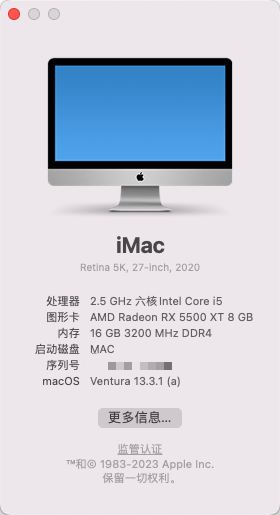
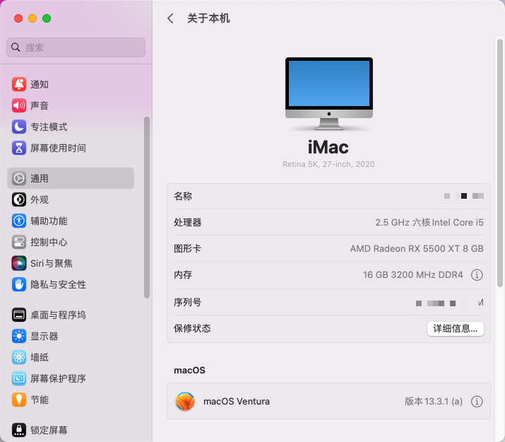
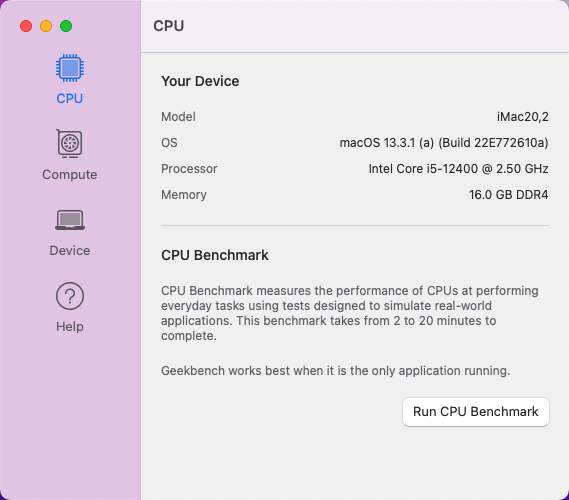

## **七彩虹CVN B660I GAMING FROZEN V20+12400+5500xt**

## 配置

| 配置         | 型号                                  |
| ------------ | ------------------------------------- |
| CPU          | intel i5 12400                        |
| 主板         | 七彩虹CVN B660I GAMING FROZEN V20     |
| 显卡         | 5500xt                                |
| 内存         | 英睿达DDR4 3200 8Gx2                  |
| 网卡         | ax201                                 |
| 硬盘         | 三星980 1T                            |
| OC版本       | 0.9.1                             |
| macOS        | macOS Ventura           |
| 机型         | iMac20.2              |
| 主板BIOS版本 | CVN B660I GAMING FROZEN V20 BIOS 1006 |

> BIOS设置
>
> 1. 关闭CSM（启动模式仅UEFI）
> 2. 关闭re-size bar（⚠️如果没有关闭卡acpi warnging: unsupported module-level）
> 3. 默认开启DisableoMapper所以无需关闭vt-d

> **注意**：本版本只适配了macOS Ventura，如果使用其他的版本，将会出现无法使用无线，蓝牙等的情况，同时主板bios版本低于1005
>
> ⚠️蓝牙和WIFI虽然可以使用，但依旧存在BUG，建议使用有线连接

***⚠️注意：本EFI使用不保证成功，使用存在一定风险，一切后果自负，默认下载即同意该协议***

配置参考教程

1. [**黑果小兵的部落阁**](https://blog.daliansky.net/)
2. [OpenCore 官方文档](https://github.com/acidanthera/OpenCorePkg/blob/master/Docs/Configuration.pdf)
3. [Xjn´s Blog 使用 OpenCore 引导黑苹果](https://blog.xjn819.com/post/opencore-guide.html)
4. [国光的黑苹果安装教程](https://apple.sqlsec.com)

